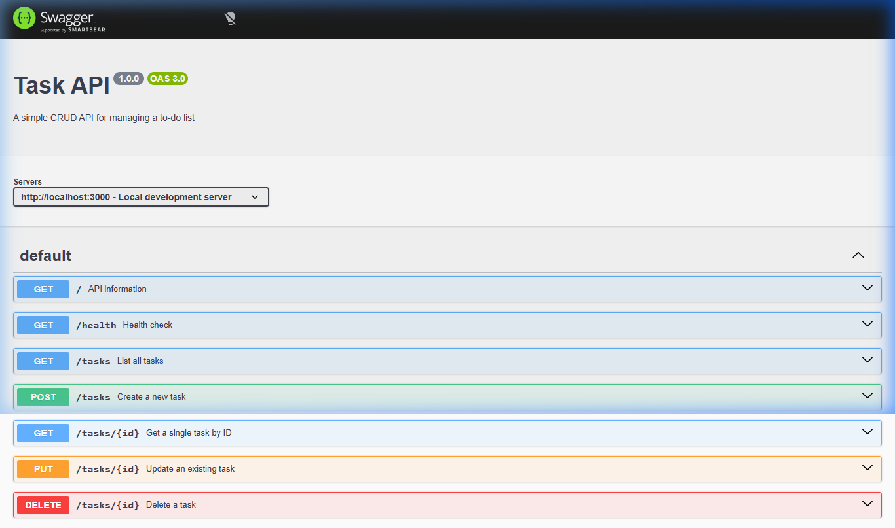

# ✅ Task API – CRUD To-Do List

A simple RESTful API built with **Node.js + Express** that manages a to-do list.  
You can **C**reate, **R**ead, **U**pdate, and **D**elete tasks — all data is kept in memory (no database, so it resets when the server restarts).

---

## 🚀 Quick Start

```bash
# 1. Clone the repository
git clone https://github.com/your-username/todo-api.git
cd todo-api

# 2. Install dependencies
npm install

# 3. Start the server
npm start
```

The server runs at **http://localhost:3000**  
Swagger UI (interactive docs) at **http://localhost:3000/docs**

---

## 📋 Endpoints

| Method | Path           | Description                         | Status Codes                |
| :----- | :------------- | :---------------------------------- | :-------------------------- |
| GET    | `/`            | API information                     | 200                         |
| GET    | `/health`      | Health check                        | 200                         |
| GET    | `/tasks`       | List all tasks                      | 200                         |
| GET    | `/tasks/:id`   | Get a single task by ID             | 200, 404                    |
| POST   | `/tasks`       | Create a new task                   | 201, 400                    |
| PUT    | `/tasks/:id`   | Update a task (title and/or done)   | 200, 400, 404               |
| DELETE | `/tasks/:id`   | Delete a task                       | 204, 404                    |

---

## 🧪 Example `curl` Commands

### Create a task
```bash
curl -i -X POST http://localhost:3000/tasks \
  -H "Content-Type: application/json" \
  -d '{"title": "Buy milk"}'
```
**Response:** `201 Created` with the new task.

### Get all tasks
```bash
curl -i http://localhost:3000/tasks
```

### Get a specific task
```bash
curl -i http://localhost:3000/tasks/1
```

### Update a task
```bash
curl -i -X PUT http://localhost:3000/tasks/1 \
  -H "Content-Type: application/json" \
  -d '{"done": true}'
```

### Delete a task
```bash
curl -i -X DELETE http://localhost:3000/tasks/1
```

---

## 🖥️ Swagger UI Screenshot



---

## 🧠 Lessons Learned

- **In-memory storage**: data disappears when the server restarts — that's why Week 3 introduces databases.  
- **Manual OpenAPI spec**: writing it by hand teaches you every detail of your API's contract.  
- **Validation**: the server must never trust the client; we validate `title` and `done` types.

---

## 🔧 Technologies Used

- [Node.js](https://nodejs.org/)
- [Express](https://expressjs.com/)
- [Swagger UI Express](https://www.npmjs.com/package/swagger-ui-express)

---

## 📦 Author

Santosh – [SKKammar](https://github.com/SKKammar)
