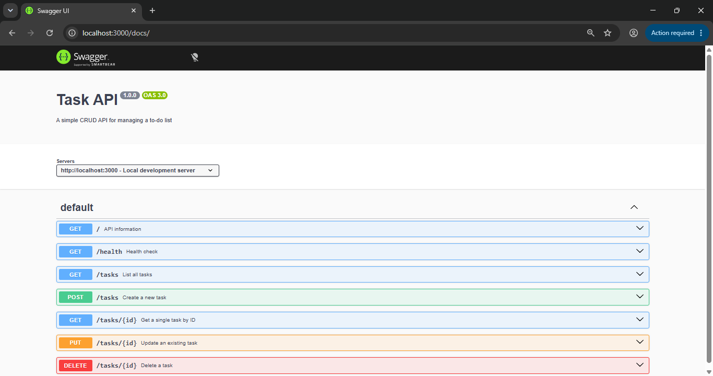

# ✅ Task API – Simple CRUD To-Do List

This repository contains a meticulously crafted, **simple RESTful API** built with **Node.js + Express** that manages a to-do list.  
You can **C**reate, **R**ead, **U**pdate, and **D**elete tasks following the best practices of API design — all data is securely stored in a local **SQLite database**, ensuring it persists between server restarts.

---

## 🚀 Quick Start

```bash
# 1. Clone the repository
git clone https://github.com/your-username/todo-api.git
cd todo-api

# 2. Install dependencies
npm install

# 3. Start the server
npm start
```

The server runs at **http://localhost:3000**  
Swagger UI (interactive docs) at **http://localhost:3000/docs**

---

## 📋 Endpoints

| Method | Path           | Description                         | Status Codes                |
| :----- | :------------- | :---------------------------------- | :-------------------------- |
| GET    | `/`            | API information                     | 200                         |
| GET    | `/health`      | Health check                        | 200                         |
| GET    | `/tasks`       | List all tasks                      | 200                         |
| GET    | `/tasks/:id`   | Get a single task by ID             | 200, 404                    |
| POST   | `/tasks`       | Create a new task                   | 201, 400                    |
| PUT    | `/tasks/:id`   | Update a task (title and/or done)   | 200, 400, 404               |
| DELETE | `/tasks/:id`   | Delete a task                       | 204, 404                    |


---

## 🧪 Example `curl` Commands

### Create a task
```bash
curl -i -X POST http://localhost:3000/tasks \
  -H "Content-Type: application/json" \
  -d '{"title": "Buy milk"}'
```
**Response:** `201 Created` with the new task.

### Get all tasks
```bash
curl -i http://localhost:3000/tasks
```

### Get a specific task
```bash
curl -i http://localhost:3000/tasks/1
```

### Update a task
```bash
curl -i -X PUT http://localhost:3000/tasks/1 \
  -H "Content-Type: application/json" \
  -d '{"done": true}'
```

### Delete a task
```bash
curl -i -X DELETE http://localhost:3000/tasks/1
```

---

## 🖥️ Swagger UI Screenshot



---

## 🧠 Lessons Learned

- **Database Persistence**: Transitioning from an in-memory array to a persistent SQLite database ensures that user data survives server restarts, which is essential for real-world production applications.
- **Strict Data Validation**: The server must never implicitly trust client input. Enforcing strict type checks (e.g., verifying `id` is a number, `status` is a boolean) prevents bugs and ensures robust, reliable endpoints.
- **API Documentation**: Whether writing an OpenAPI specification by hand or utilizing tools to generate a `swagger.json`, maintaining clear documentation is critical for defining the API's contract and facilitating easy testing via Swagger UI.

---

## 🔧 Technologies Used

- [Node.js](https://nodejs.org/)
- [Express](https://expressjs.com/)
- [Swagger UI Express](https://www.npmjs.com/package/swagger-ui-express)

---

## 📦 Author

Santosh – [SKKammar](https://github.com/SKKammar)

---

## Storage & Database Setup

This API uses a SQLite database instead of in-memory storage. 

**Why SQLite?**
SQLite was chosen because it requires zero configuration, operates entirely out of a single local file (`tasks.db`), and requires no separate background server process to be installed. It guarantees that our data persists and survives server restarts.

**Getting Started:**
To start this project locally, simply clone the repository, install dependencies, and start the server. The `tasks.db` file and the `tasks` table will be created and seeded automatically.

1. `npm install`
2. `node index.js`

**Database File:**
The database is stored locally in `tasks.db`. **Note:** This file is included in `.gitignore` so that every new clone starts with a fresh, empty database.

**Example SQL Query (Stage 4):**
I tested modifying the database directly in DB Browser using this query to find only completed tasks:
`SELECT * FROM tasks WHERE done = 1;` 
This successfully returned one row (the seeded "Complete FlyRank Stage 0" task).

## A3 — Containerized Postgres

Run the stack locally with one command:
```sh
cp .env.example .env && docker compose up
```

### Environment Variables
| Variable | Description |
|---|---|
| DATABASE_URL | PostgreSQL connection string |
| PORT | Port for the Express server to listen on |

### Endpoints
| Method | Path | Request Body | Success Status | Error Statuses |
|---|---|---|---|---|
| GET | `/` | - | 200 | - |
| GET | `/health` | - | 200 | - |
| GET | `/tasks` | - | 200 | 500 |
| GET | `/tasks/:id` | - | 200 | 404, 500 |
| POST | `/tasks` | `{ "title": "string" }` | 201 | 400, 500 |
| PUT | `/tasks/:id` | `{ "title": "string", "done": boolean }` | 200 | 400, 404, 500 |
| DELETE | `/tasks/:id` | - | 204 | 404, 500 |

Example request:
```sh
curl -i http://localhost:3000/tasks
```
